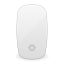
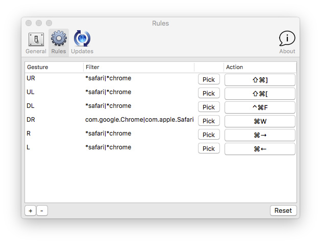
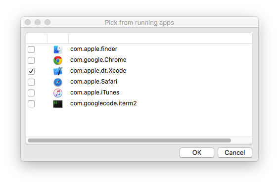

title: MacGesture2.0发布了
date: 2015-10-18 20:28:01
tags:
---
# 介绍

[MacGesture](https://github.com/CodeFalling/MacGesture)是我在大二暑假时折腾的一个小工具，OS X让我最不适用的地方就是浏览器没有好用的鼠标手势（我用Chrome/Safari），于是就自己fork了一个keakon的项目改了改。但最后的成品并不如意，手势卡，设置困难（当时正被Emacs洗脑的我决定使用lua配置手势），手势预览难看。

代码扔在Github上也莫名其妙的涨了十几个star，又有几位并不认识的朋友说这个工具十分有用，让我感到很羞愧。于是趁着有空把原来的代码重写了一遍，出了个2.0版本。

<!--more-->

# 下载

去[Github](https://github.com/CodeFalling/MacGesture/releases)下载最新版本，或者从[这个链接](http://7lrvsy.com1.z0.glb.clouddn.com/MacGesture.zip)直接下载。

# 和老版本相比的优点

- 配置方便

- 解决性能方面的bug

# 缺点

 仍然只是个简单的工具，而且在较短的时间内开发出来，还有未知的bug，功能也比较弱，只能做到手势转成快捷键。

代码也仍然比较烂，所幸自己还看得懂。

如果有什么建议，非常欢迎发[Issue](https://github.com/CodeFalling/MacGesture/issues)或者[Pull&Requests](https://github.com/CodeFalling/MacGesture/pulls#fork-destination-box)。

# 基本使用方式

程序启动后，会在menubar显示一个光标，点击Preference显示配置界面

## Preference

该界面会在第一次启动时自动启动，

Open Preferences Window at Startup：每次启动时打开此界面

Show Gesture Preview：开启手势预览（就是箭头）。

Disable Mouse Path：屏蔽鼠标路径（蓝色的轨迹线）

Auto Start at Login: 登录时自动启动

Block filter：要完全屏蔽的程序，使用通配符匹配，`|`分隔，有些程序可能会和
MacGesture冲突，你可以在此设置将其关闭。例如我在XCode中常常要右键拖动，XCode的Bundle identifier是`com.apple.dt.xcode`（`/Application/XCode.app/Content/Info.plist`中可以看到），在此填入`*xcode`即可（我比较懒）。如果还有其他程序，可以使用形如`*xcode|*appcode`。

Pick：从当前运行的应用中选取应用，生成filter，可多选

## Rules

规则设置，Gesture列表示手势，UDLR分别表示上下左右（Up Down Left Right），这里的Filter是生效规则，只有满足Filter的应用程序才适用于该规则。Action则表示对应的快捷键，点击重设。

当手势和包名满足时，对应的快捷键会被发送，以此可以满足大部分功能的设置，未来可能会考虑加入AppleScript支持（事实上代码中已经留了这个坑）。

## 其他

~~~ 更新功能目前还不能使用，需要留意Github的更新，需要及时得到消息的可以点Github上得`watch`。~~~

更新功能已经正常，以后可以通过自动更新获取新的版本。

有更多的问题欢迎发邮件给code.falling@gmail.com，也可以加入MacGesture用户qq群（498035635）讨论
